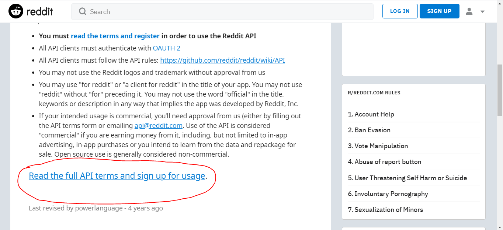
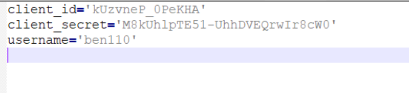
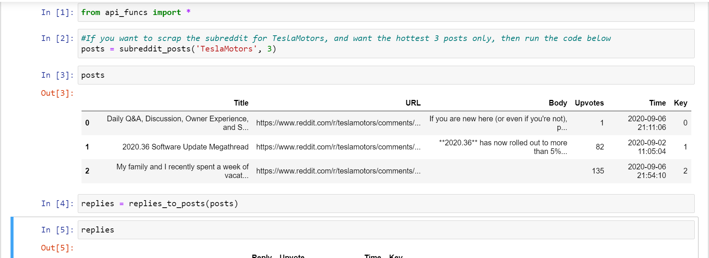

# Working with the Reddit API using the PRAW package
* [Getting access](#API)
* [How to use the API](#Use)
* [Reddit Data](#Red)
* [The PRAW module](#Pr)    

## Getting access to the Reddit API 
1. You will first need a reddit account if you don't have one, register for one [here](https://www.reddit.com/wiki/api): 
     
   

2. Then, navigate back to the page [here](https://www.reddit.com/wiki/api), scroll down, click on the circled link, which will take you to a form:  
     
    
	 
3. You can fill in the form in any way you like, but make sure that you give the correct email under "POC Email". When you reach the "OAUTH Client ID(s)" part,
click on the link:  
         
    
 	
4. Click on the button that says "are you a developer? create an app..."    

   
 
5. You can fill in the blanks in any way you like, but make sure you select "web app", and for the redirect uri type in "http://localhost:8080 ".  
   
   
    
	
6. Now you should have something that looks like the image below. The code under "web app" near the top is your client ID, while the secret is your secret. you will need them later.  
   
   
   
   
7. Go back and complete filling out the form. Thats all the paperwork done.  
  
## How to use the API   
There are two ways to do this, you can have a look at the Reddit.ipynb file and build your own code using that as a guide. Or if you wish you can use the code I created.
If you are using the code I wrote, then:
* Download the api_funcs.py file INTO YOUR PROJECT FOLDER.
* Create a python file called keys.py. 
* Put your client ID, secret and username into the keys.py like below. Make sure the variable names are the same as the image below:  

* Please note, your notebook should be in the same project folder as the keys.py and api_funcs.py files. The example below shows you how to gather data using the files.  

  
  
* Make sure to test it with a small number of posts first to make sure it works! The maximum number of posts at a time is 500. But you might not need that much because each post
can have up to several hundred replies so a hundred posts would give you probably ten thousand replies.  
  
* Unfortunately the API is rate limited so it will take a while if you are scraping a lot of data...  

## Reddit data 
The posts csv file contain information about the Reddit posts on Tesla. 
  
See link here: https://www.reddit.com/r/teslamotors/  
* Title - Title of the post
* URL - url for the post (each post has its own url where you can see the comments for that post)
* Body - The contents of each post 
* Upvotes - The number of upvotes of the post
* Time - Timestamp of post(I have converted it from utc timestamp for you)
* Key - The is a unique key allocated to each post. This is important because it links the post from the posts file
with the associated comments from the comments file.  
 

The comments csv file contains information of comments/replies made to each of the posts in the posts file. 
* Reply - The comments made in response to the post
* Time - Timestamp of the comments
* Upvote - Number of upvotes of the comment
* Key - This is a key that associates each comment in the comments file with the post it belongs to in the posts file. 
 
---
### The PRAW module 
But if you are interested, the link below is very beginner friendly and is also how I got started with PRAW.
* https://www.privateproxyreviews.com/scrape-reddit-using-praw-python/#reddit-has-made-scraping-more-difficult-here-s-why
 

Once you have a handle on the basics, the PRAW documentation provides an comprehensive overview of PRAW's functionalities
* https://praw.readthedocs.io/en/latest/  
